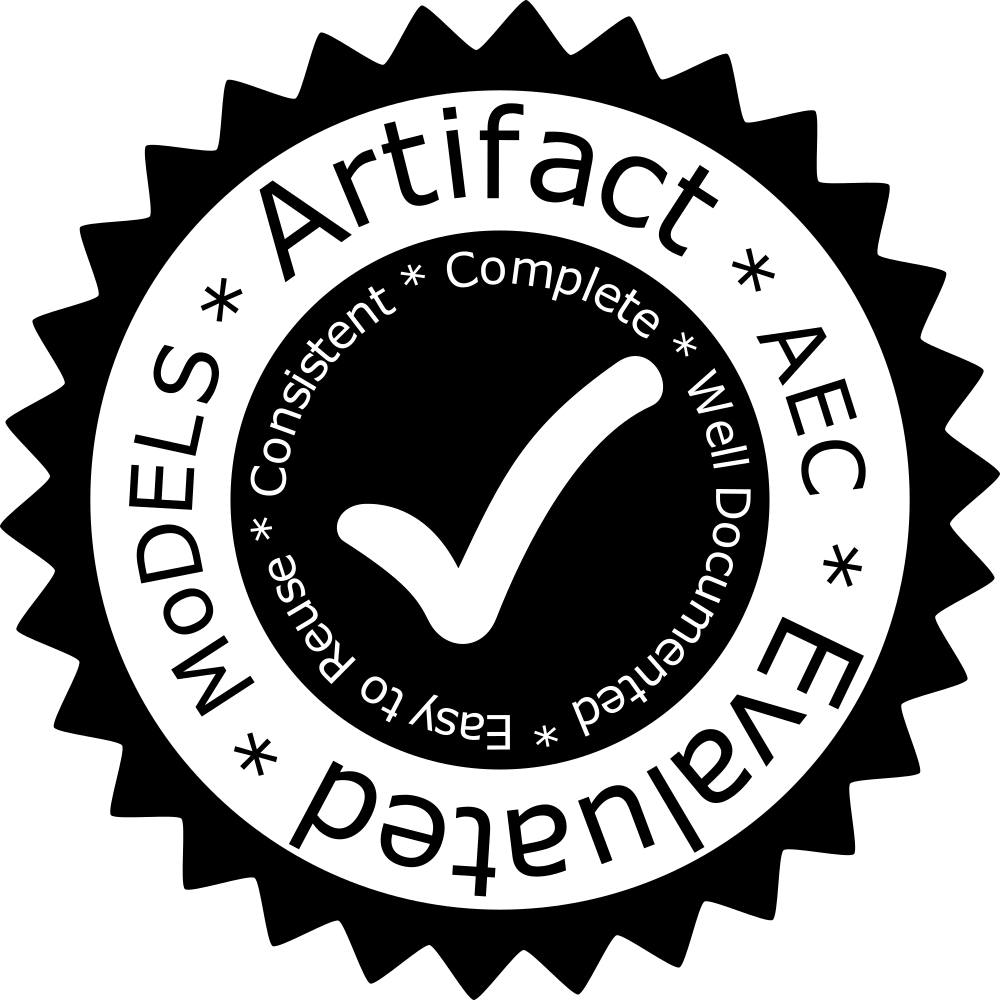

# The MoDELS AEC badge: [models-aec-badge.pdf](https://github.com/grammarware/models17/raw/master/models-aec-badge.pdf).

You are encouraged to put the badge on your paper, following the directions below (we list _two_ distinct ways to do it)

You are also welcome to use the [PNG bitmap](https://github.com/grammarware/models17/blob/master/models-aec-badge.png) variant to mark your paper on your web page if you wish.

Please do **not** use this badge in any way other than these without first discussing it with [the artefact evaluation chairs](mailto:models-artifacts@cs.utexas.edu) **@[grammarware](https://github.com/grammarware)** and **@[wasowski](https://github.com/wasowski)**.

## Instructions

If you follow these instructions correctly, you should end up with a stamp on the front page of your paper

### Option 1: Use LaTeX.

Copy `models-aec-badge.pdf` into your paper directory and insert the following
fragment in your paper preamble.  You can change the vertical
placement of the stamp by adjusting the `'3.5in'` in the `\raisebox` as
necessary.

```
\usepackage[firstpage]{draftwatermark}
\SetWatermarkText{\hspace*{8in}\raisebox{3.5in}{\includegraphics[scale=0.1]{models-aec-badge}}}
\SetWatermarkAngle{0}
```

### Option 2: Use [Acrobat Pro](https://acrobat.adobe.com/us/en/acrobat/acrobat-pro.html) (tested on Version 9)

Load your document and then use the Document -> Watermark -> Add... menu.

a.  Be sure to select "Page Range Options", top left to ensure only
the first page is marked.

b.  Select "File" and "Choose..." `models-aec-badge.pdf`

c.  Select "Scale relevant to target page", and set it to 10%

d.  For Position, set Vertical Distance to 2 inches from top and
Horizontal Distance to 0.75 inches from right.

Please [let us know](mailto:models-artifacts@cs.utexas.edu) if you run into any trouble.

> This text was inherited from the OOPSLA 2016 AEC Chairs (Mike Hind and Mike Bond) who got it from the previous year's chairs.


