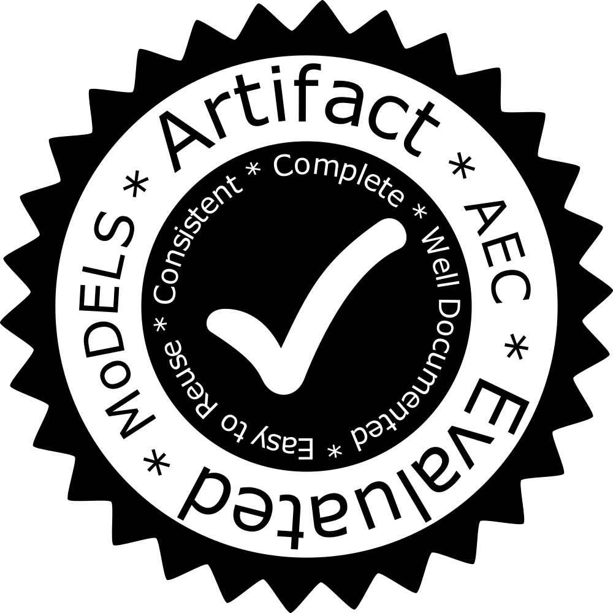

# MoDELS 2017 Artifact Evaluation

- [Artifact Evaluation at MoDELS webpage](https://models17ae.itu.dk)
- All artifacts are subject to their corresponding licenses.
- All reviews and comments are open with attribution to their authors ([CC-BY](https://creativecommons.org/licenses/by/4.0/)).
- All final decisions are public domain.
- All software for managing that process (GitHub) is open source and readily usable. 

______
For any questions concerning this process, please contact [the artefact evaluation chairs](mailto:models-artifacts@cs.utexas.edu) **@[grammarware](https://github.com/grammarware)** and **@[wasowski](https://github.com/wasowski)**. For instructions on putting the badge on the camera ready copy of your paper, please consult a [specially written badge manual](Badge.md).
