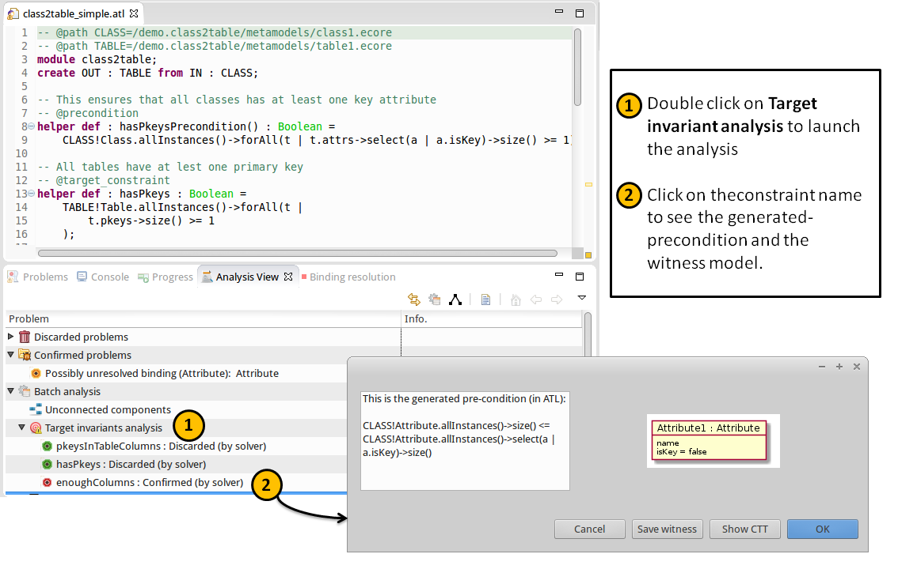

# Translating target to source constraints in model-to-model transformations
Jesús Sánchez Cuadrado, Esther Guerra, Juan De Lara, Robert Clarisó and Jordi Cabot

This paper presents a method to generate source pre-conditions from target constraints (e.g., postconditions,
meta-model invariants). This method has many applications like ensuring strong executability of 
a model-to-model transformation (i.e., checking if there exists a source model satifying the 
transformation pre-conditions which could violate a target constraint), characterizing classes of target models and checking transformation contracts.

The method has been implemented for ATL and integrated into [AnATLyzer](http://sanchezcuadrado.es/projects/anatlyzer "AnATLyzer"), an static analysis tool for ATL. In particular, the generation of pre-conditions has been integrated
with a model finder.

## Usage of AnATLyzer

To try he target constraint analysis you need to install AnATLyzer. 
Here is a brief summary of how to install and use it.

### Required software

* Eclipse (tested on Eclipse Luna, Mars and Neon)
* Java 8
* ATL 3.x
* Zest 1.5 (optional)
* UML 2.x (optional)

### Update site

* The update site is at [http://sanchezcuadrado.es/projects/anatlyzer/sites/anatlyzer.updatesite](http://sanchezcuadrado.es/projects/anatlyzer/sites/anatlyzer.updatesite)
* Go to `Help -> Install New Software` 
* Click on the `Add...` button to add the update site
* Locate the update site in the `Work with` combo box
* Sometimes you need to uncheck the `Group items by category`
* Check the features that you want to install and click `Finish`

### Setting up a transformation

* Create new regular ATL project (if it does not exist yet): File -> New -> ATL Project
* Activate AnATLyzer: Right-click on the project -> Add anATLyzer nature
* Every ATL file in the project will be statically analysed every time it is saved, and errors will be reported in the problem view.
* Do not forget to add the @nsURI or @path annotations at the beginning of the transformation to provide the transformation meta-models.
* It is highly recommended to use the anATLyzer view, which provides more information about the problems in the active transformation, including actions to run the constraint solver, quick fix problems and visualization. To do so, `Window -> Show View -> anATLyzer -> Analysis View`
* Troubleshooting: sometimes you need to run the analysis explicitly. Click on the button with two yellow arrows in the Analysis view.

### Checking target constraints

Constraints can be written directly in the ATL transformation file as helpers specially annotated. 
There are three kinds of annotations for pre-conditions, target constraints (e.g., invariants or post-conditions) 
and transformations contracts. 
 

* **Pre-conditions**. A pre-condition is indicated annotating a helper with the @precondition tag. A pre-condition can only access source elements. The following is pre-condition for a class-to-table transformation.

```ocl
  -- Every class must have at least one key attribute
  -- @precondition
  helper def : attrKeys : Boolean = 
    CLASS!Class.allInstances()->forAll(t | 
       t.attrs->select(a | a.isKey)->size() >= 1) 
```

* **Target constraints**. A target constraint is indicated annotating a helper with the @target_constraint tag. 
A target constraint can only access target elements.

```ocl
    -- All tables have at lest one primary key
    -- @target_constraint
    helper def : hasPkeys : Boolean = 
       TABLE!Table.allInstances()->forAll(t | 
          t.pkeys->size() >= 1
       );  
```

* **Contracts**. A transformation contract establishes a relationship between source and target elements. It is indicated annotating a heper with the @contract tag.

```ocl
    -- @contract
    helper def : enoughColumns : Boolean = 
       CLASS!Attribute.allInstances()->size() <= 
       TABLE!Column.allInstances()->size();
```

AnATLyzer provides a feature to check the satisfiability of target constraints and contracts
with respect to the transformation. For each constraint the advancing algorithm presented in the
paper is used to generate a pre-condition. The pre-condition is then negated and fed into the
USE Validator model finder in order to search for a counter example. If it is found, then the
constraint is not satisfied by the transformation.



### Screencast

* Here is a [screencast](https://www.youtube.com/watch?v=VmMiOujxk0M "screencast") showing 
how to execute the analysis of target constraints.
* The example used in the screencast can be downloaded [here](http://sanchezcuadrado.es/projects/anatlyzer/data/models2017/demo_class2table.zip)


## Experimental data

To evaluate our method to generate pre-conditions from target constraints we have followed
the following procedure:

* We have selected three transformations ER2REL, HSM2FSM and Factory2PN. The ATL project with the transformation is available here: [Seed transformations](http://sanchezcuadrado.es/projects/anatlyzer/data/models2017/evaluation_project.zip "Seed transformations").   
* These transformations contains a number of target constraints.
* The target constraints are mutated applying a series of mutation operators in order to generate many different variants
of them. 
* Each mutated constraint is advanced (i.e., to generate a pre-condition). 
* Random models conforming the input meta-models are generated. 
* For each input model, the pre-conditions are checked and the transformation is executed. The following case may occur:
   - True positive: the input model satisfies the advanced constraint and output model obtained by executing the transformation satisfies the target constraint 
   - True negative: the input model does not satisfy the advanced constraint and the output model does not satisfy the target constraint
   - False positive: the input model satisfies the advanced constraint but the output model does not satisfy the target constraint
   - False negative: if the input model does not satisfy the advanced constraint,
but the output model satisfies the target constraint
* The complete set of generated mutants is available here: [Full evaluation](http://sanchezcuadrado.es/projects/anatlyzer/data/models2017/evaluation-full.zip "Full evaluation").
This file includes the generated mutants, the input models and the output models generated by random testing and by executing the transformations. It is around 1GB uncompressed.
* The summarized results are available as Excel spreadsheets including a summary and detailed results for each transformation: [Results](http://sanchezcuadrado.es/projects/anatlyzer/data/models2017/evaluation-summary.zip "Results")

## Running the experiments

To reproduce the experiment follow these steps:

* You need to have anATLyzer installed (or the sources available) as explained above. 
* You need to import the [experiment script](http://sanchezcuadrado.es/projects/anatlyzer/data/models2017/pos2pre.evaluation.zip "Script") into Eclipse (it is just an Eclipse project with a (Java) script to run the experiment.
* Run a new Eclipse instance. 
* Import the project with the [seed transformations](http://sanchezcuadrado.es/projects/anatlyzer/data/models2017/evaluation_project.zip "Seed transformations").
* The experiment must be run independently for each transformation. Right-click on the ATL transformation to evaluate -> EVALUATE pre-conditions. 
* The process will generate a temp directory with all the mutants and xls files summarizing the result. Beware that the process may take several hours.

## Discussion of the results

 The experiment shows an almost perfect precision and perfect recall. The evaluation uncovered one kind of false positive (FP). It refers to a limitation of our method to handle 1-to-n rules, which happens when syntactically correct invariant expressions test for impossible reachabilities between target objects which are satisfiable in the source. The following is a minimal example to illustrate this issue.

Let us consider the following constraint over Petri nets.

```ocl
	-- @target_constraint
	helper def: isStateMachine : Boolean =
	  PN!Transition.allInstances()->forAll(t |
	     PN!TPArc.allInstances()->one(arc | arc.input = t ) and 
	     PN!PTArc.allInstances()->one(arc | arc.input = t )
	     -- arc.input = t is always false, because the type of 
	     -- PTArc::input is Place, while the type of t is Transition 
	 );
```

Then, let us suppose a rule which transforms Generator objects (i.e., belonging to Factory DSL). This is a 1-to-3 rule, which means that the target elements come from the same source element.

```ocl
	rule Generator2Transition {
	 from
	  m : FAC!Generator
	 to
	  t : PN!Transition ( ... ),
	  p : PN!Place ( ... ),
	  p2t : PN!PTArc (
	   weight <- 1,
	   input <- p,
	   output <- t,
	   net <- m.factory
	  )
	}
```

The advanced constraint generated by the method is as follows. As can be observed this is trivially satisfiable. The problem is that sub-expression in the third line is satisfiable, but it is generated from a target constraint which is not satisfiable. This particular case can be detected statically and avoid generating an incorrect source constraint.

```ocl
	FAC!Generator.allInstances()->forAll(t | 
	  FAC!Generator.allInstances()->one(arc | arc = t) and
	  FAC!Generator.allInstances()->one(arc | arc = t)) 
```
